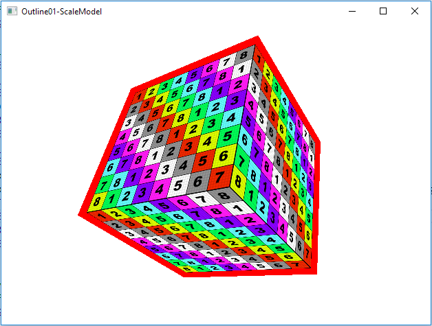
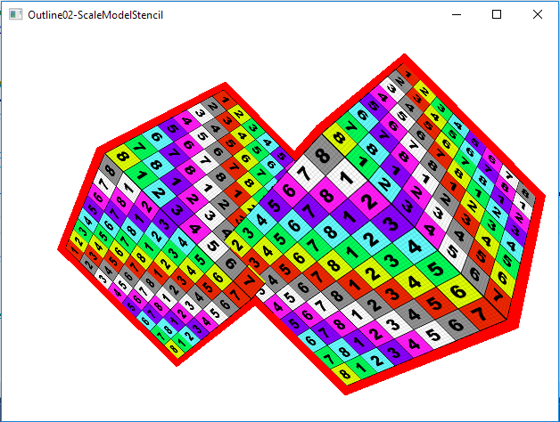
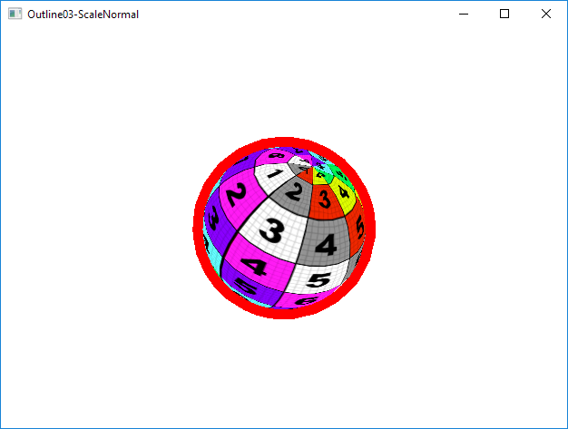
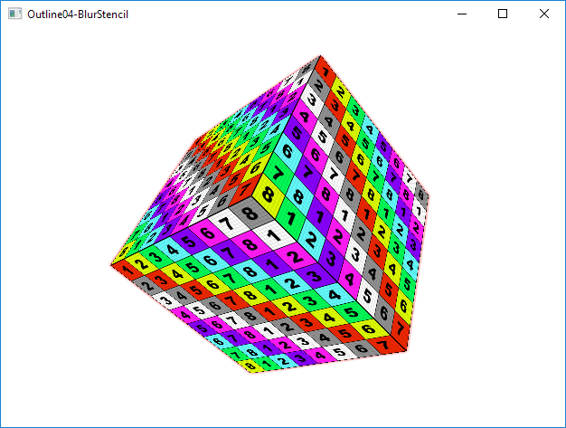

# OpenGLOutline

several OpenGL outline implementations

# Environment
Win10, VS2017, OpenGL 3.3

# Build & Run

Open OpenGLOutline.sln in VS2017, press F5 to build & run one of the projects as a Win32 window application:

* **Outline01-ScaleModel**: Scale up the model and draw with flat color, then draw the original model.  
  
* **Outline02-ScaleModelStencil**: Draw the original model and set stenil to 1, then scale up the model and draw with flat color but ignore fragments whose stenil value is 1 via stencil test.  
  
* **Outline03-ScaleNormal**: Scale up the model by offet every vertex along its normal direction and draw with flat color, then draw the original model.  
  
* **Outline04-BlurStencil**: Draw textured box to default framebuffer, set valid fragments' stencil to 0xFF; draw flat-colored box to the framebuffer; draw the blurred framebuffer quad to default framebuffer.  
    
  Note, a 1-pixel narrow red outline is around the box, because we uses a 3x3 kerning for blurring. This will be improved.
